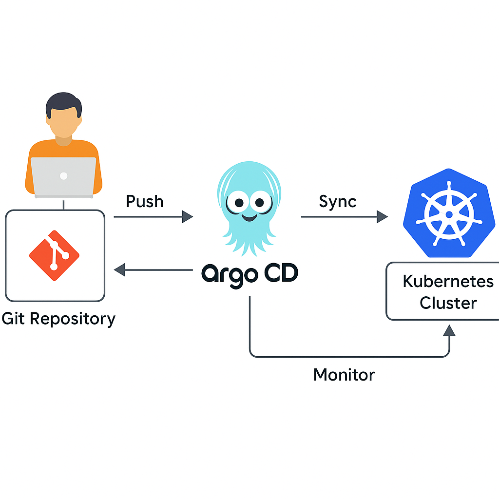

# 🚀 Argo CD - GitOps Continuous Delivery for Kubernetes

**Argo CD** is a **declarative, GitOps-based Continuous Delivery tool** for Kubernetes. It enables you to automatically deploy and manage Kubernetes resources by syncing the desired state from a Git repository to your Kubernetes clusters.

---

## 🧩 Key Concepts

* **GitOps**: Git is the source of truth for application definitions and configurations.
* **Declarative Configuration**: Define Kubernetes workloads using YAML manifests, Helm charts, or Kustomize.
* **Continuous Delivery**: Automatically sync changes from Git to Kubernetes clusters.
* **Access Interfaces**: Manage applications via Web UI, CLI, or REST API.

---

## 📐 Architecture

* **argocd-server**: Web UI and API endpoint.
* **argocd-repo-server**: Clones and renders Git repositories.
* **argocd-application-controller**: Monitors and syncs application state.
* **argocd-dex-server**: (Optional) Handles SSO authentication.

---

## 🎯 GitOps with Argo CD Diagram

The diagram below illustrates how GitOps works with Argo CD:



* Developers push code and configuration to a Git repository.
* Argo CD watches the Git repository for changes.
* When changes are detected, Argo CD syncs the desired state to the Kubernetes cluster.
* The actual state of the cluster is continuously monitored and kept in sync.

---

## ⚙️ Installation Guide

### ✅ Prerequisites

* Kubernetes cluster (Minikube, EKS, GKE, etc.)
* `kubectl` installed and configured

### 1. Install Argo CD in `argocd` namespace

```bash
kubectl create namespace argocd
kubectl apply -n argocd -f https://raw.githubusercontent.com/argoproj/argo-cd/stable/manifests/install.yaml
```

### 2. Expose the Argo CD API Server

#### Option A: Port Forwarding (for local testing)

```bash
kubectl port-forward svc/argocd-server -n argocd 8080:443
```

Access the Argo CD UI at: [https://localhost:8080](https://localhost:8080)

### 3. Get the Initial Admin Password

```bash
kubectl get secret argocd-initial-admin-secret -n argocd \
  -o jsonpath="{.data.password}" | base64 -d && echo
```

### 4. Install Argo CD CLI (Optional)

#### macOS:

```bash
brew install argocd
```

#### Linux:

```bash
VERSION=$(curl --silent "https://api.github.com/repos/argoproj/argo-cd/releases/latest" | grep '"tag_name":' | sed -E 's/.*\"v([^\"]+)\".*/\1/')
curl -sSL -o argocd "https://github.com/argoproj/argo-cd/releases/latest/download/argocd-linux-amd64"
chmod +x argocd
sudo mv argocd /usr/local/bin/
```

### 5. Login to Argo CD CLI

```bash
argocd login localhost:8080 --username admin --password <your-password>
```

### 6. Create an Application from a Git Repository

```bash
argocd app create guestbook \
  --repo https://github.com/argoproj/argo-cd-example-apps.git \
  --path guestbook \
  --dest-server https://kubernetes.default.svc \
  --dest-namespace default
```

### 7. Sync the Application

```bash
argocd app sync guestbook
```

---

## 🌐 Web UI Access

* URL: [https://localhost:8080](https://localhost:8080)
* Username: `admin`
* Password: Retrieved from step 3

---

## ✅ Summary

| Feature               | Description                         |
| --------------------- | ----------------------------------- |
| GitOps-Based          | Sync Kubernetes manifests from Git  |
| Web UI and CLI        | Manage apps via GUI or command-line |
| Declarative Configs   | All configurations are YAML-based   |
| Sync Strategies       | Manual, Automatic, and Hook-based   |
| Multi-Cluster Support | Yes, out-of-the-box                 |

---
